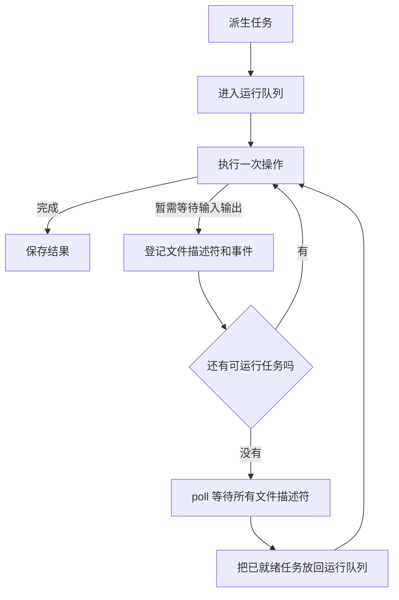

# 异步模块使用说明

此模块供单线程协作式任务调度与非阻塞输入输出。宜于并管多个网络连接；然不使普通计算自动于多处理器上并行。

相关源码：

- `异步。豫`：任务、运行队列与输入输出事件循环。
- `../网络/异步传输控制协议。豫`：异步连接、接受、读取、写入。
- `../../../运行时支持库/原生/输入输出多路等待.c`：基于 `poll` 之多路等待。

## 一、先记三个概念

### 任务

`异步任务于甲`，谓“将来得一甲类型结果之任务”。

任务所处之态有四：

- 待运行；
- 正在运行，或等待输入输出；
- 已成功，并存结果；
- 已失败，并存异常文字。

### 运行队列

`派生`惟建任务，并以操作入运行队列，不立行其操作。

### 输入输出等待集合

非阻塞操作若返“暂需等待”，任务即离运行队列，登记其所待之文件描述符与可读、可写事件。

调度之序如次：



惟当运行队列为空、且确有输入输出等待项时，调度器方阻塞于一次多路 `poll`。故其不循环检套接字，徒耗处理器之时间。

## 二、导入模块

惟用普通异步任务：

```text
寻「标准库」之书。
寻观「标准库」之「控制」之「异步」之书。

观「标准库」之书。
```

复须异步网络：

```text
寻「标准库」之书。
寻观「标准库」之「控制」之「异步」之书。
寻观「标准库」之「网络」之「传输控制协议」之书。
寻观「标准库」之「网络」之「异步传输控制协议」之书。

观「标准库」之书。
```

传输控制协议模块亦有名为 `等待` 之函数。两模块同时打开时，应书全名以调用任务等待：

```text
「控制」之「异步」之「等待」授以「结果类型」于「任务」
```

## 三、创建并等待普通任务

```text
「甲任务」者「派生」授以「整数」于（会「无」而
    「二零」
）也。

「乙任务」者「派生」授以「整数」于（会「无」而
    「二二」
）也。

「甲结果」者「等待」授以「整数」于「甲任务」也。
「乙结果」者「等待」授以「整数」于「乙任务」也。

「打印行」于（「整数表示」于（「加」于「甲结果」于「乙结果」））。
```

输出为：

```text
42
```

其关键之序如次：

1. 两 `派生` 惟以甲、乙任务入队。
2. `等待甲任务` 始推动调度器。
3. 调度器行甲任务，存二零。
4. `等待甲任务` 得二零而返。
5. `等待乙任务` 续推动调度器，得二二。

## 四、何操作推动调度器

### 等待

```text
「等待」授以「甲」于「任务」
```

任务若已完成，立返结果；若未完成，则续行他可运行之任务，或待输入输出事件，讫于目标任务之成。

任务操作所抛异常，先存于任务中，后由 `等待` 复抛。

### 让出

```text
「让出」于「元」
```

让出当前执行之机，行下一任务。若无普通任务而有输入输出等待项，则或待一次输入输出事件。

任务不自动抢占。一长时执行、且从不等待、从不让出之普通计算，将阻塞其余一切任务。

### 运行

```text
「运行」授以「整数」于（会「无」而
    「四二」
）
```

`运行操作` 等若先 `派生操作`，复 `等待` 所生之任务。

`运行` 惟保指定之根任务完成，不保一切无关后台任务皆行毕。

## 五、异步 TCP 何以有两层结果

如 `异步读取` 之类型为：

```text
传输连接
    -> 整数
    -> 异步任务于（操作结果于字符串）
```

两层各表不同之题：

- `异步任务` 表操作是否仍在调度、是否抛语言异常；
- `操作结果` 表套接字操作成功、关闭，或返系统错误。

故得字符串须两步：

```text
「读取结果」者
    「控制」之「异步」之「等待」授以（「操作结果」于「字符串」）于「读取任务」
也。

鉴「读取结果」而
有（「操作成功」于「内容」）则「打印行」于「内容」
或有「连接已关闭」则「打印行」于『连接已关闭』
或有（「操作失败」于「状态」）则「发生事故」于（「错误消息」于「状态」）
或有（「暂需等待」于「值」）则「发生事故」于『异步任务不应以暂需等待结束』。
```

异步封装于底层现“暂需等待”时，登记事件并重试。故已成之异步 TCP 任务，通常不复返“暂需等待”。

## 六、完整之本地异步连接示例

下例同时发起接受与连接，复同时发起读取与写入。

```text
「必须成功」乃承「甲」而化（「操作结果」于「甲」）而「甲」也。
「必须成功」者受「甲」而会「结果」而
    鉴「结果」而
    有（「操作成功」于「值」）则「值」
    或有（「暂需等待」于「值」）则（「甲」也（「发生事故」于『操作仍要求等待』））
    或有「连接已关闭」则（「甲」也（「发生事故」于『连接提前关闭』））
    或有（「操作失败」于「状态」）则（「甲」也（「发生事故」于（「错误消息」于「状态」）））
也。

「监听套接字」者
    「必须成功」授以「传输连接」于（「监听」于『127.0.0.1』于「零」于「一六」）
也。
「端口」者「必须成功」授以「整数」于（「获取本地端口」于「监听套接字」）也。

「接受任务」者「异步接受」于「监听套接字」也。
「连接任务」者「异步开始连接」于『127.0.0.1』于「端口」也。

「客户端」者「必须成功」授以「传输连接」于
    （「控制」之「异步」之「等待」授以（「操作结果」于「传输连接」）于「连接任务」）
也。
「服务端」者「必须成功」授以「传输连接」于
    （「控制」之「异步」之「等待」授以（「操作结果」于「传输连接」）于「接受任务」）
也。

「读取任务」者「异步读取」于「服务端」于「一零二四」也。
「写入任务」者「异步写入」于「客户端」于『你好，异步』也。

「收到内容」者「必须成功」授以「字符串」于
    （「控制」之「异步」之「等待」授以（「操作结果」于「字符串」）于「读取任务」）
也。
「写入数」者「必须成功」授以「整数」于
    （「控制」之「异步」之「等待」授以（「操作结果」于「整数」）于「写入任务」）
也。

「打印行」于「收到内容」。
```

行读取任务时，若服务端套接字尚无数据，读取任务即登记“等待可读”，其后调度器可行写入任务。写入既成，套接字转为可读，读取任务方复运行。

实际可运行之例，见 `测试/标准库/异步/非阻塞输入输出-1。豫`。

## 七、异步 TCP 接口

### 连接与接受

```text
「异步开始连接」于「主机」于「端口」
「异步接受」于「监听套接字」
```

二者皆返 `异步任务于（操作结果于传输连接）`。

`监听` 与 `获取本地端口` 自身不待网络事件，今仍径用传输控制协议模块中之同步入口。

### 读取

```text
「异步读取」于「连接」于「最大字节数」
「异步读取字节串」于「连接」于「最大字节数」
```

一次成功惟返当前已读之内容，不表已达消息边界，亦不表连接已闭。应用层协议须自累积、解析数据。

### 写入

```text
「异步写入」于「连接」于「字符串」
「异步从字节序数写入」于「连接」于「字符串」于「起始字节序数」

「异步写入字节串」于「连接」于「字节串」
「异步从字节序数写入字节串」于「连接」于「字节串」于「起始字节序数」
```

一次成功或惟写部分字节；所返之整数为实写之数。须全写时，应用必累加写入之位，并自新字节序数续调。

## 八、完成状态与立即完成任务

```text
「完成了吗」授以「甲」于「任务」
「立即完成」授以「甲」于「值」
```

`完成了吗` 于成功、失败之任务皆返阳；此惟表任务已止，不表任务已成。

`立即完成` 建一已存结果、无须入调度队列之任务。

## 九、高级用法：派生自定义非阻塞操作

普通应用通常惟须调用异步传输控制协议模块。为其他运行时文件描述符写封装时，可用 `派生可等待`。

所传之操作，每次必返下列二步骤之一：

```text
「异步步骤完成」于「最终结果」

（「异步步骤等待输入输出」授以「最终结果类型」）
    于「文件描述符」
    于「关注事件」
```

关注事件今用与传输控制协议相同之位：

- `关注可读`；
- `关注可写`；
- `关注可读写`。

描述符就绪后，同一操作将复执行。故操作必能安全重试，并以跨步骤之进度存于引用或闭包状态中。未返等待步骤之前，不可失已读、已写或已解析之位。

## 十、常见错误

### 于异步任务中调用阻塞等待

勿于异步任务中调用：

```text
「等待可读」于「连接」于「超时」
「等待可写」于「连接」于「超时」
```

此二旧接口将径阻塞当前线程。宜改用 `异步读取`、`异步写入` 等异步封装。

### 派生后从不等待或让出

惟调 `派生`，不启后台线程。程序必调 `等待`、`让出` 或 `运行`，以推动调度器。

### 以一次读取为完整消息

TCP 乃字节流。一次读取或仅得半条消息，或并得数条消息；必依应用层协议决读取何时成。

### 忽略部分写入

`异步写入` 之成，不表全数已写出；必检所返之实写数。

### 忘记关闭连接

异步任务不自动闭套接字。连接用毕，仍应调传输控制协议模块中之 `关闭`。

## 十一、当前限制

- 单线程协作式调度，非多线程并行计算；
- 普通任务不遭抢占；
- 尚无任务取消；
- 尚无异步定时器与每任务超时；
- `等待` 仍以嵌套调用推进他任务，深等待链增原生调用栈；
- `运行` 不自动待一切无关后台任务。

须超时语义时，应于事件循环加定时器等待集合，不可复用阻塞式套接字超时。
