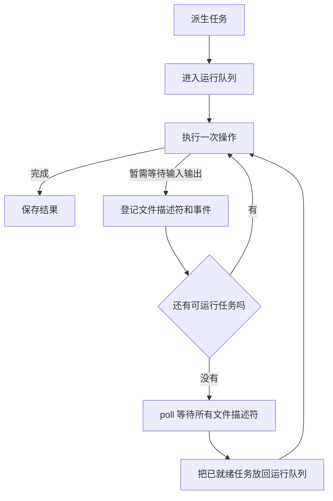

# 异步模块使用说明

本模块提供单线程协作式任务调度和非阻塞输入输出。它适合同时管理多个网络连接，但不会让普通计算自动在多个处理器上并行运行。

相关源码：

- `异步。豫`：任务、运行队列和输入输出事件循环。
- `../网络/异步传输控制协议。豫`：异步连接、接受、读取和写入。
- `../../../运行时支持库/原生/输入输出多路等待.c`：基于 `poll` 的多路等待。

## 一、先记住三个概念

### 任务

`异步任务于甲` 表示“将来会得到一个甲类型结果的任务”。

任务可能处于以下状态：

- 待运行；
- 正在运行或等待输入输出；
- 已成功并保存结果；
- 已失败并保存异常文字。

### 运行队列

`派生`只创建任务并把操作加入运行队列，不会立即执行操作。

### 输入输出等待集合

非阻塞操作如果返回“暂需等待”，任务会离开运行队列，并登记自己所等待的文件描述符和可读、可写事件。

调度过程如下：



只有当运行队列为空且确实存在输入输出等待项时，调度器才会阻塞在一次多路 `poll` 上。因此它不会循环检查套接字并浪费处理器时间。

## 二、导入模块

只使用普通异步任务：

```text
寻「标准库」之书。
寻观「标准库」之「控制」之「异步」之书。

观「标准库」之书。
```

还要使用异步网络：

```text
寻「标准库」之书。
寻观「标准库」之「控制」之「异步」之书。
寻观「标准库」之「网络」之「传输控制协议」之书。
寻观「标准库」之「网络」之「异步传输控制协议」之书。

观「标准库」之书。
```

传输控制协议模块也有一个名为`等待`的函数。两个模块同时打开时，应写完整名称来调用任务等待：

```text
「控制」之「异步」之「等待」授以「结果类型」于「任务」
```

## 三、创建和等待普通任务

```text
「甲任务」者「派生」授以「整数」于（会「无」而
    「二零」
）也。

「乙任务」者「派生」授以「整数」于（会「无」而
    「二二」
）也。

「甲结果」者「等待」授以「整数」于「甲任务」也。
「乙结果」者「等待」授以「整数」于「乙任务」也。

「打印行」于（「整数表示」于（「加」于「甲结果」于「乙结果」））。
```

输出为：

```text
42
```

这里的关键顺序是：

1. 两次`派生`只把甲、乙任务加入队列。
2. `等待甲任务`开始推动调度器。
3. 调度器运行甲任务并保存二零。
4. `等待甲任务`取得二零并返回。
5. `等待乙任务`继续推动调度器并取得二二。

## 四、哪些操作会推动调度器

### 等待

```text
「等待」授以「甲」于「任务」
```

如果任务已经完成，立即返回结果。如果尚未完成，就持续执行其他可运行任务或等待输入输出事件，直到目标任务完成。

任务操作抛出的异常会先保存在任务中，之后由`等待`重新抛出。

### 让出

```text
「让出」于「元」
```

让出当前执行机会并运行下一个任务。如果没有普通任务但存在输入输出等待项，它可能等待一次输入输出事件。

任务不会自动抢占。一个长时间执行且从不等待、从不让出的普通计算，会阻塞其他所有任务。

### 运行

```text
「运行」授以「整数」于（会「无」而
    「四二」
）
```

`运行操作`等价于先`派生操作`，再`等待`生成的任务。

`运行`只保证指定的根任务完成，不保证把所有不相关的后台任务全部执行完。

## 五、异步 TCP 为什么有两层结果

例如`异步读取`的类型是：

```text
传输连接
    -> 整数
    -> 异步任务于（操作结果于字符串）
```

两层分别表达不同问题：

- `异步任务`表示操作是否仍在调度、是否抛出了语言异常；
- `操作结果`表示套接字操作成功、关闭或返回系统错误。

所以取得字符串需要两个步骤：

```text
「读取结果」者
    「控制」之「异步」之「等待」授以（「操作结果」于「字符串」）于「读取任务」
也。

鉴「读取结果」而
有（「操作成功」于「内容」）则「打印行」于「内容」
或有「连接已关闭」则「打印行」于『连接已关闭』
或有（「操作失败」于「状态」）则「发生事故」于（「错误消息」于「状态」）
或有（「暂需等待」于「值」）则「发生事故」于『异步任务不应以暂需等待结束』。
```

异步封装会在底层出现“暂需等待”时登记事件并重试。因此一个已经完成的异步 TCP 任务通常不会再返回“暂需等待”。

## 六、完整的本地异步连接示例

下面的例子同时发起接受和连接，再同时发起读取和写入。

```text
「必须成功」乃承「甲」而化（「操作结果」于「甲」）而「甲」也。
「必须成功」者受「甲」而会「结果」而
    鉴「结果」而
    有（「操作成功」于「值」）则「值」
    或有（「暂需等待」于「值」）则（「甲」也（「发生事故」于『操作仍要求等待』））
    或有「连接已关闭」则（「甲」也（「发生事故」于『连接提前关闭』））
    或有（「操作失败」于「状态」）则（「甲」也（「发生事故」于（「错误消息」于「状态」）））
也。

「监听套接字」者
    「必须成功」授以「传输连接」于（「监听」于『127.0.0.1』于「零」于「一六」）
也。
「端口」者「必须成功」授以「整数」于（「获取本地端口」于「监听套接字」）也。

「接受任务」者「异步接受」于「监听套接字」也。
「连接任务」者「异步开始连接」于『127.0.0.1』于「端口」也。

「客户端」者「必须成功」授以「传输连接」于
    （「控制」之「异步」之「等待」授以（「操作结果」于「传输连接」）于「连接任务」）
也。
「服务端」者「必须成功」授以「传输连接」于
    （「控制」之「异步」之「等待」授以（「操作结果」于「传输连接」）于「接受任务」）
也。

「读取任务」者「异步读取」于「服务端」于「一零二四」也。
「写入任务」者「异步写入」于「客户端」于『你好，异步』也。

「收到内容」者「必须成功」授以「字符串」于
    （「控制」之「异步」之「等待」授以（「操作结果」于「字符串」）于「读取任务」）
也。
「写入数」者「必须成功」授以「整数」于
    （「控制」之「异步」之「等待」授以（「操作结果」于「整数」）于「写入任务」）
也。

「打印行」于「收到内容」。
```

执行读取任务时，如果服务端套接字尚无数据，读取任务会登记“等待可读”，然后调度器可以执行写入任务。写入完成后套接字变为可读，读取任务才会恢复。

实际可运行示例位于`测试/标准库/异步/非阻塞输入输出-1。豫`。

## 七、异步 TCP 接口

### 连接和接受

```text
「异步开始连接」于「主机」于「端口」
「异步接受」于「监听套接字」
```

它们返回`异步任务于（操作结果于传输连接）`。

`监听`和`获取本地端口`本身不会等待网络事件，目前仍直接使用传输控制协议模块中的同步入口。

### 读取

```text
「异步读取」于「连接」于「最大字节数」
「异步读取字节串」于「连接」于「最大字节数」
```

一次成功只返回当前已经读到的内容，不表示已经到达消息边界，也不表示连接已经关闭。应用层协议必须自行累积和解析数据。

### 写入

```text
「异步写入」于「连接」于「字符串」
「异步从字节序数写入」于「连接」于「字符串」于「起始字节序数」

「异步写入字节串」于「连接」于「字节串」
「异步从字节序数写入字节串」于「连接」于「字节串」于「起始字节序数」
```

一次成功可能只写入部分字节。返回的整数是实际写入数。需要完整写入时，应用必须累加写入位置，并从新的字节序数继续调用。

## 八、完成状态和立即完成任务

```text
「完成了吗」授以「甲」于「任务」
「立即完成」授以「甲」于「值」
```

`完成了吗`对成功和失败任务都返回阳；它只表示任务已经终止，不表示任务成功。

`立即完成`创建一个已经保存结果、无需进入调度队列的任务。

## 九、高级用法：派生自定义非阻塞操作

普通应用通常只需调用异步传输控制协议模块。为其他运行时文件描述符编写封装时，可以使用`派生可等待`。

传给它的操作每次必须返回以下两种步骤之一：

```text
「异步步骤完成」于「最终结果」

（「异步步骤等待输入输出」授以「最终结果类型」）
    于「文件描述符」
    于「关注事件」
```

关注事件目前使用与传输控制协议相同的位：

- `关注可读`；
- `关注可写`；
- `关注可读写`。

描述符就绪后，同一个操作会再次执行。因此操作必须能安全重试，并把跨步骤进度保存在引用或闭包状态中。不要在返回等待步骤之前丢失已经读取、写入或解析的位置。

## 十、常见错误

### 在异步任务中调用阻塞等待

不要在异步任务中调用：

```text
「等待可读」于「连接」于「超时」
「等待可写」于「连接」于「超时」
```

这两个旧接口会直接阻塞当前线程。应改用`异步读取`、`异步写入`等异步封装。

### 派生后从不等待或让出

仅调用`派生`不会启动后台线程。程序必须调用`等待`、`让出`或`运行`来推动调度器。

### 把一次读取当成完整消息

TCP 是字节流。一次读取可能只得到半条消息，也可能同时得到多条消息。必须按应用层协议决定何时读取完成。

### 忽略部分写入

`异步写入`成功不代表全部内容已经写出。必须检查返回的实际写入数。

### 忘记关闭连接

异步任务不会自动关闭套接字。连接使用完毕后仍应调用传输控制协议模块中的`关闭`。

## 十一、当前限制

- 单线程协作式调度，不是多线程并行计算；
- 普通任务不会被抢占；
- 尚无任务取消；
- 尚无异步定时器和每任务超时；
- `等待`仍通过嵌套调用推进其他任务，深层等待链会增加原生调用栈；
- `运行`不会自动等待所有无关后台任务。

需要超时语义时，应在事件循环中加入定时器等待集合，而不是重新使用阻塞式套接字超时。
