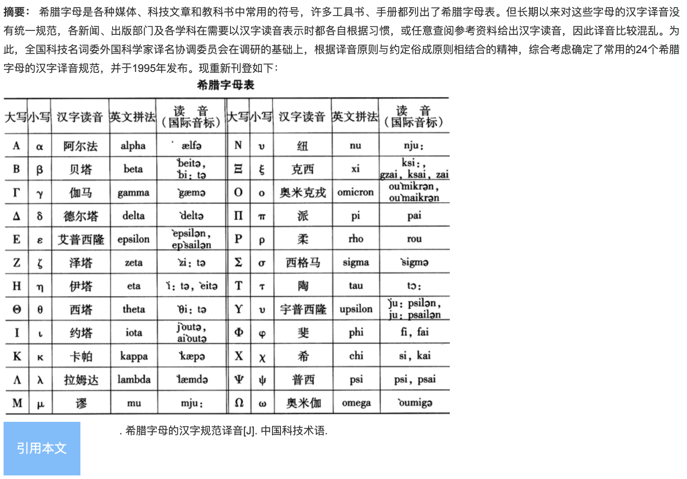

# 希腊字母音译表

本篇记录 24 个希腊字母的汉字译音，依全国科技名词委外国科学家译名协调委员会 1995 年发布的规范，原载《中国科技术语》。国际音标一栏见篇末原图。

| 大写 | 小写 | 汉字读音 | 英文拼法 |
| --- | --- | --- | --- |
| Α | α | 阿尔法 | alpha |
| Β | β | 贝塔 | beta |
| Γ | γ | 伽马 | gamma |
| Δ | δ | 德尔塔 | delta |
| Ε | ε | 艾普西隆 | epsilon |
| Ζ | ζ | 泽塔 | zeta |
| Η | η | 伊塔 | eta |
| Θ | θ | 西塔 | theta |
| Ι | ι | 约塔 | iota |
| Κ | κ | 卡帕 | kappa |
| Λ | λ | 拉姆达 | lambda |
| Μ | μ | 缪 | mu |
| Ν | ν | 纽 | nu |
| Ξ | ξ | 克西 | xi |
| Ο | ο | 奥米克戎 | omicron |
| Π | π | 派 | pi |
| Ρ | ρ | 柔 | rho |
| Σ | σ | 西格马 | sigma |
| Τ | τ | 陶 | tau |
| Υ | υ | 宇普西隆 | upsilon |
| Φ | φ | 斐 | phi |
| Χ | χ | 希 | chi |
| Ψ | ψ | 普西 | psi |
| Ω | ω | 奥米伽 | omega |

英文字母的写法见[英文字母翻译](英文字母翻译.汉语.md)，术语译名见[翻译列表](翻译列表.汉语.md)。

