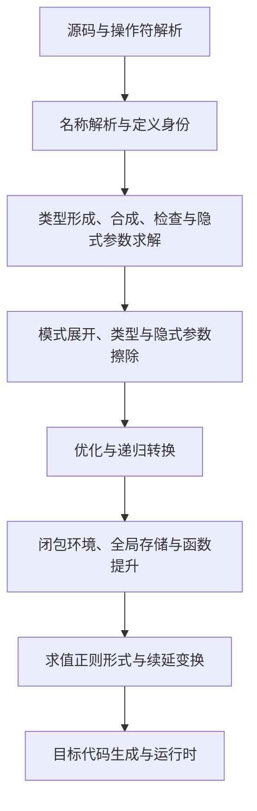

# 豫言语言规范编撰方案

本文是官网语言 specification 的研究结论与编撰方案，尚不是定稿规范。研究基线为 `yybs` 提交 `4cdeca11600fed16338793a494b6eecaae94485a`；当前分支已 rebase 至该提交，无冲突。研究对象是当前源码与测试，未读取 `*_v0`。源码审查发现与可执行程序验证应分别记录，不把已有测试文件的存在当作本轮测试通过。

## 一、规范定位

建议首先编撰“当前实现规范草案”，逐条确定技术语义，再转为可承诺兼容性的语言规范。已有[语言规范](语言规范.汉语.md)可作为语法材料，但缺少完整语法、静态语义、动态语义和错误条件，不能只通过增加示例完成升级。

豫言当前可概括为：以中文定界符和混合位置操作符表达的、静态类型的、支持参数多态与代数数据构造的函数式编程语言；允许引用、输入输出、异常等副作用。函数是一等值，运行时采用严格求值；连续函数类型和连续调用有多参数分组及饱和要求。类型参数推断受具体规则约束，不承诺一般依赖类型、任意类型级计算或自动部分应用。

文档分为三个层次：

1. **语言规范**：程序是否合法、表达式的类型是什么、程序可观察行为是什么。
2. **实现说明**：编译器如何实现这些规则，包括名称解析、类型合成与检查、擦除、闭包、ANF、续延及后端。
3. **标准库与平台契约**：内建原语、引用、异常、异步、外部调用及平台限制；普通库接口链接至包文档。

每条规则标记“已由源码确认”“已由用例验证”或“待决议”。不得把某个后端偶然行为直接写成语言保证；也不得把拟议功能混入现行语法。

## 二、源码研究与技术方案

下表中的路径相对于仓库根目录。后续规范给每条规则设置稳定编号，维护规则、源码和测试的对应关系。

| 主题 | 当前实现结论 | 编撰要求与源码入口 |
| --- | --- | --- |
| 词法 | `「」` 包围名称，`『』` 包围字符串；`「：…：」` 注释可嵌套。词法器显式跳过空格、换行、制表，不宜写成“所有 Unicode 空白均忽略”。 | [词法解析](../库/编译器核心/编译步骤/语法分析/词法解析。豫)：列出字符集合、闭合规则、字符串转义、非法输入。换行还影响注释归属，区分语义与编辑器元数据。 |
| 数字 | 名称形式在抽象语法阶段被识别为数字；支持逐位汉字和阿拉伯数字，以 `点` 或 `.` 分隔小数。识别字符集合不包含负号、指数、十百千万。 | [整数小数解析](../库/编译器核心/编译步骤/语法分析/整数小数解析。豫)：明确数字识别与普通名称解析的先后，补测空小数部分、混合数字及越界。不要把不匹配数字规则等同于立即产生词法错误。 |
| 语法与优先级 | 操作符由组件模式和成对规约关系定义；`于` 左结合，`与`、`合`、`；` 右结合，`之` 对 `于` 优先；未列出的组合还受回退规则约束。 | [文言符集](../库/编译器核心/编译数据/操作符/内建操作符/文言符集。豫)、[表达式解析](../库/编译器核心/编译步骤/语法分析/表达式解析。豫)：给完整 EBNF 与结合关系附表，不能凭直觉压成一张未经证明的全序优先级表。 |
| 声明与透明性 | `乃` 后必须紧接同名定义；`者` 是不透明值定义，`即` 走类型检查及透明类型展开，`立` 建立构造器。顶层递归有按类型/定义形态插入递归节点的机制。 | [抽象语法分析](../库/编译器核心/编译步骤/语法分析/抽象语法分析。豫)、[文件结构检查](../库/编译器核心/编译步骤/类型检查/文件结构检查。豫)：写清无标注定义的可合成范围、自引用条件。`即` 不应描述为任意值的宏展开。 |
| 名称与模块 | 名称解析先查当前绑定，再查命名空间，再查打开文件；命名空间有同名定义的特殊处理。重导出保留原始定义身份。文件引用不能直接作为一等运行时对象。 | [名称解析](../库/编译器核心/编译步骤/名称解析/名称解析。豫)：分别定义 `寻`、`观`、`诵` 及组合。进一步锁定重名、遮蔽、声明顺序及初始化规则。包查找路径由豫构上下文管理。 |
| 类型形成 | 有内建类型、箭头类型、隐式类型参数、元组、名义构造器及其应用。类型应用头必须能解析为构造器，参数须是类型，最终须完全应用为类型。 | [类型类型检查](../库/编译器核心/编译步骤/类型检查/类型类型检查。豫)、[内建类型](../库/标准库/语言核心/内建类型。豫)：写形成规则与拒绝规则，不泛称“任意类型函数”。 |
| 旧式带名类型参数 | `化 T 者 a 而 B` 与 `承 T 者 a 而 B` 经兼容入口限制定义域，再降为隐式类型参数形式。 | [内建操作符类型定义](../库/编译器核心/编译数据/操作符/内建操作符/内建操作符类型定义。豫)：主文推荐 `承「甲」而…`，旧形式列入兼容语法；不能把前者解释成普通运行时依赖参数。 |
| 类型检查方法 | 实现分别提供类型形成、对象类型合成、对期望类型检查。无类型参数的函数主要由期望函数类型检查。隐式参数从显式实参及期望结果收集约束，结构匹配求解，未解则拒绝。 | [对象类型检查](../库/编译器核心/编译步骤/类型检查/对象类型检查。豫)、[类型检查工具](../库/编译器核心/编译步骤/类型检查/类型检查工具。豫)、[函数应用隐式参数合成](../库/编译器核心/编译步骤/类型检查/函数应用隐式参数合成。豫)：用双向类型判断说明算法和必须标注的位置，不宣传为完整 Hindley–Milner 推断。 |
| 类型相等 | `断言类型相等` 使用结构比较；比较抽象时统一绑定名，并有局部扩展比较分支。“对象子类型检查”目前实际断言类型相等。 | [模式合一](../库/编译器核心/编译步骤/类型检查/模式合一。豫)、[模式合一结构比较](../库/编译器核心/编译步骤/类型检查/模式合一结构比较。豫)：透明类型展开与结构比较分开叙述，不宣称一般子类型或任意 β 归约等价。 |
| 调用 | 调用解析为头与参数序列；存在实参时要求当前参数组饱和，显式参数之间不接受隐式实参。函数值本身仍可传递。 | [函数应用隐式参数合成](../库/编译器核心/编译步骤/类型检查/函数应用隐式参数合成。豫)：正式定义参数组、显隐实参顺序和结果继续应用；[禁止部分应用负例](../测试/缺陷/禁止部分应用/禁止部分应用-1。豫)直接覆盖常见误读。 |
| 数据与序列 | `与`/`合` 构造元组值/类型，`中` 投影。`「列」【…】` 展开为 `缀` 与 `罄`；`「典」【…】` 为构建配置保留，扩展头为阶段协议保留。 | [内建操作符对象定义](../库/编译器核心/编译数据/操作符/内建操作符/内建操作符对象定义。豫)：区分通用外形和被允许的头，不写成“任意对象均支持方括号调用”或“运行时字典字面量”。 |
| 模式匹配 | 分支进行类型检查后展开为决策树；实现具有缺少分支的运行时报错路径，并对部分未使用分支发出警告。 | [模式匹配类型检查](../库/编译器核心/编译步骤/类型检查/模式匹配类型检查。豫)、[模式匹配展开](../库/编译器核心/编译步骤/类型标注擦除/模式匹配展开。豫)：不能承诺所有非穷尽匹配静态拒绝；需用重叠模式明确顺序与默认分支限制。 |
| 动态语义 | ANF 变换顺序遍历函数及其参数，局部绑定先处理定义再处理后式；顺序执行和分支保留独立节点。 | [无类型正则变换](../库/编译器核心/编译步骤/求值正则变换/无类型正则变换。豫)：以按值求值、词法闭包、存储状态和异常传播定义语言语义；“先函数后实参、实参从左到右”须再以副作用测试检查优化前后端。 |
| 运行时边界 | 原生运行时中 `豫言值` 是 128 位容器，整数运算解码为 `int64_t`，小数使用 `double`。容器宽度不等于整数精度。 | [类型定义](../运行时支持库/原生/类型定义.h)、[基本运算](../运行时支持库/原生/基本运算.c)、[垃圾回收器](../运行时支持库/原生/垃圾回收器.c)：数值可观察行为需与代码生成核对；布局和 GC 算法放实现附录。 |
| 副作用与异步 | 引用、异常、输入输出通过内建原语及库提供；异步库采用单线程协作调度。编译器的并行构建另由异步调度原生子进程实现。 | [异步说明](../库/标准库/控制/异步使用说明.汉语.md)：分别描述语言求值、库调度、构建并行，不推导为语言默认多线程。 |

### 类型系统如何写清楚

建立以下判断，不直接照抄内部节点名：

- `Γ ⊢ A type`：类型合法；说明内建类型、元组、箭头和构造器应用的形成条件。
- `Γ ⊢ e ⇒ A`：从表达式合成类型。
- `Γ ⊢ e ⇐ A`：根据期望类型检查表达式，给无标注函数、分支及隐式参数提供上下文。
- `Γ ⊢ A ≡ B`：按明确的透明展开和结构规则比较类型。

规则附一个成功例和一个最邻近失败例。例如：完整二参数调用成功，少一个参数失败；给定期望类型可确定空列元素类型，无上下文且无法解出类型参数时失败。高阶参数、返回多态值、显式 `授以` 和自动实例化分别测试，不用“支持泛型”一句话带过。

名义类型身份需要说明“同形不同声明是否相同”，实现中的构造器身份包含文件、名称或序数等信息；跨模块重导出必须保持身份，内部编号不能成为公开 ABI。`元类型` 的接受规则也不等于已经具备宇宙层级、逻辑一致性或终止性证明。

### 求值与编译技术如何写清楚

规范以抽象环境和存储定义求值，可采用 `⟨e, ρ, σ⟩ ⇓ ⟨v, σ′⟩`，另列异常与不终止。需要明确：函数形成时捕获环境而不执行函数体；调用对运行时实参严格求值；`虑` 绑定求值结果；`；` 丢弃前值但保留副作用；条件只执行所选分支；模式分析对象求值次数必须被规定。

实现说明采用下列路线，并链接[中间语言与阶段分离](中间语言与阶段分离.汉语.md)。这里是分组概览，不要求每个后端具有同样阶段：

解释这些阶段解决的具体问题：名称解析固定引用目标；类型检查拒绝非法组合；擦除移除静态信息；模式展开生成决策；递归转换建立自引用；闭包转换显式保存捕获值；ANF 固定中间值与求值次序；后端把这些操作映射到平台。

另设 LLVM 原生、LLVM/WASI、WasmGC 直接生成的实现资料表，逐项核对入口、数值、字符串、异常、外部接口、回收与尾调用支持；仓库存在后端实现不意味着三者已通过同一套语义测试。不得将原生 128 位布局或某条完整降级链写成所有目标必须遵循的语言规则。

## 三、正式规范目录

建议保留现有《语言规范》双语入口，正文逐步拆为以下章节。

| 章 | 内容 | 必须回答的问题 |
| --- | --- | --- |
| 〇、范围与一致性 | 版本、规范用语、实现定义行为、兼容语法 | 哪些规则已承诺，哪些仍是草案？ |
| 一、源码与词法 | 编码、名称、数字、字符串、注释、空白 | 哪些字符合法，失败发生在哪个阶段？ |
| 二、语法与结合 | 完整语法、操作符、分组、顶层句界 | 同一文本唯一解析为什么树？ |
| 三、绑定与声明 | 作用域、遮蔽、声明配对、透明定义、自引用 | 名称何时可见，何时能引用自身？ |
| 四、类型与数据 | 内建类型、构造器、元组、参数类型 | 什么是类型，何谓类型相同？ |
| 五、函数与多态 | 抽象、饱和调用、显隐实参、推断 | 哪些参数可以省，何时必须写标注？ |
| 六、表达式与控制 | 局部绑定、条件、顺序、投影、递归 | 求值次序、结果和作用域是什么？ |
| 七、模式匹配 | 模式语法、绑定、类型、顺序、失败 | 重叠分支如何处理，无匹配如何处理？ |
| 八、模块 | 导入、打开、重导出、初始化 | 同名如何选择，模块是否为值？ |
| 九、执行模型 | 闭包、存储、引用、异常、不终止 | 哪些行为是可观察的语言保证？ |
| 十、原语与平台 | 数值、字符串、外部接口、能力差异 | 哪些行为跨后端一致，哪些受宿主限制？ |
| 附录 | 编译技术、兼容语法、语法总表、规则索引 | 如何从实现追溯规范和回归用例？ |

每节统一包含：规则编号、语法、静态条件、动态语义、最小例、最小反例、实现依据、验证状态。中文术语为主，首次出现附标准技术名；文言版保持相同规则编号与章节，不能只译成省略条件的摘要。教程继续说明“怎样写”，规范集中说明“为何合法及确切行为”。

## 四、定稿前的关键决议与验证

| 优先级 | 待锁定事项 | 建议处理 |
| --- | --- | --- |
| 首批 | 饱和调用的参数组边界、只写隐式参数的实例化、高阶参数的推断范围 | 沿类型骨架与调用检查建立小测试矩阵，明确能否独立实例化；正文避免以旧示例推断。 |
| 首批 | 整数范围、溢出、除零、最小整数除负一 | 核对 LLVM 数值生成和各运行时；原生直接使用有符号 C 算术，不能据此承诺环绕或可捕获异常。需明确统一行为或显式平台限制。 |
| 首批 | 浮点特殊值、舍入、数值转换及字面量边界 | 分别验证字面量、运行时计算、打印与转换，避免将十进制写法误解为十进制精确数。 |
| 首批 | 参数、元组、模式对象与顶层初始化的求值顺序 | 用引用累积执行轨迹，在优化开关及目标后端下比较；模块菱形依赖检查初始化次数。 |
| 首批 | 遮蔽、重复声明、打开模块冲突、前向引用 | 分开测试局部名、顶层名、模块名、构造器名以及打开顺序；记录实际行为后决定是否承诺。 |
| 首批 | 重叠模式、默认分支位置、遗漏分支 | 检查决策树转换，测试首个成功分支、重复默认分支和无匹配路径，不仅测试类型通过。 |
| 次批 | 一般递归值、自引用初始化、异常传播 | 先规范已稳定的递归函数；非法或未初始化递归值的行为须独立确定。 |
| 次批 | 字符串编码与长度单位、内嵌零、非法编码、CRLF/BOM | 对源码读取、词法器和字符串原语分别测试，区分字节、码点与用户可见字符。 |
| 次批 | 跨目标能力及 FFI | 建立能力矩阵；外部调用目前依赖期望类型及受限参数形式，不能视为编译器会验证任意 C 签名。 |

这些事项不是要求先开发新功能；目标是辨明当前实现，并对影响兼容性的边界作出明确选择。若确需修编译器，作为单独变更处理，附行为差异和相应自举验证。

## 五、官网接入与交付顺序

现有[网站资料生成器](../工具/网站资料生成/入口。豫)已经将《语言规范》双语源文档复制到 `/指南/语言规范.汉语.html` 与 `/指南/语言规范.文言.html`。建议沿用这两个入口，保留旧地址兼容，不额外建立另一份正文。分章源文档可放在 `文档/语言规范/`，章节采用中文基名及 `.汉语.md` / `.文言.md` 后缀；生成器需要显式加入章节路由、相对链接重写、同章语言切换与规则锚点检查。此阶段只提出接入方案，未修改或发布网站。

按以下顺序交付，每一批都可独立审阅：

1. **建立事实基线**：完成本方案、现有文档缺口清单及源码定位；保留当前规范正文。
2. **编撰核心草案**：先写范围、词法语法、绑定、类型和函数；优先讲清“类型是什么、调用是否合法”。为所有未决项设置显式标记。
3. **补齐运行语义**：模式、模块、求值、引用、异常和数值边界；配套成功、编译失败和运行失败用例，逐条记录实际执行结果。
4. **形成双语规范与实现说明**：规则编号一一对应，技术实现放附录，普通库接口引用包文档；检查两种语言是否遗漏限定条件。
5. **接入官网并验收**：生成静态页面，检查站内链接、目录、规则锚点、代码显示及同章切换；构建和预览完成后按发布流程上线。

验收标准：每种公开语法都能在语法表找到，每种核心表达式都有类型与求值规则，每个重要错误条件有反例；跨目标承诺有相同结果的执行证据；未决项公开列出；源码、文档、测试可相互追溯。

本轮只新增方案文档，未改变编译器语义，不需要完整自举。采用文档命名检查、相对链接检查及差异空白检查；本轮未运行语言用例或跨后端语义验证。后续如改动编译器，依仓库要求执行稳定编译器首级串行、随后两级并行的自举、固定点比较与类型检查。
