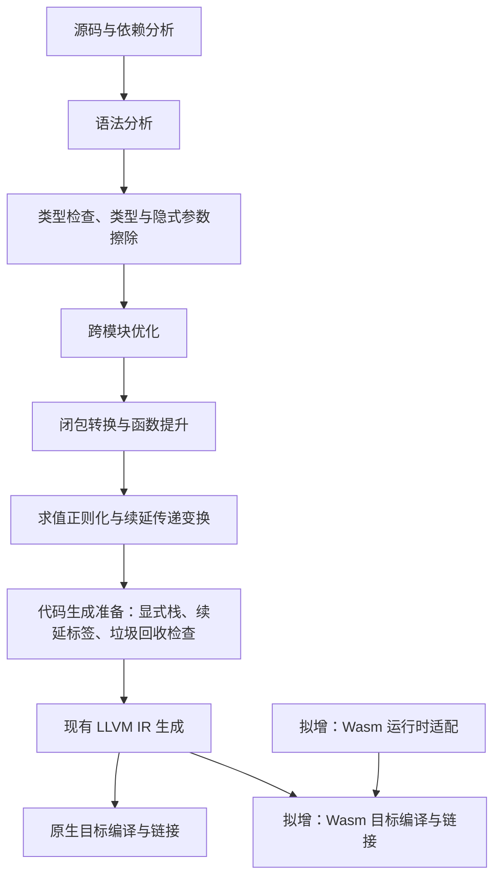

# 网页汇编后端调研

本文保留实现前的调研快照；已有最小后端的实际用法和限制见《网页汇编后端使用.汉语.md》。

调研基线：`3b68f9ec`。本文中的 Wasm 指 WebAssembly；内容包括源码审查和本机编译探针，不代表后端已经实现。对应文言本见《网页汇编后端调研.文言.md》。

建议第一阶段复用 LLVM 代码生成，增加 Wasm 目标配置和运行时适配，保留现有十六字节值、显式豫言栈及垃圾回收器。现有架构支持这条路线，但仅修改目标三元组不能完成迁移。首要运行宿主仍待确定：WASI 命令行环境或浏览器。

## 现有流水线与接入位置

| 位置 | 当前职责 | 接入所需 |
| --- | --- | --- |
| `编译步骤/总体过程/编译过程。豫`、`分布编译步骤。豫` | 顺序与分阶段编译；缓存每阶段结果 | 大体复用，保证目标配置传到代码生成和最终链接 |
| `编译步骤/求值正则变换/顶层。豫` | 求值正则化后执行续延传递变换 | 保留语言求值顺序与续延语义 |
| `编译步骤/代码生成准备变换/代码生成准备变换。豫` | 显式栈布局、参数与返回值存储、续延标签和 GC 检查 | 已带运行时约定，不能视为完全独立于后端的通用中间表示 |
| `编译步骤/代码生成/代码生成入口。豫` | 分派每个模块的代码生成 | 当前只有 `llvm` 分支；增加 Wasm 路由，可调用同一 LLVM 生成器 |
| `编译步骤/代码生成/主程序生成入口。豫` | 分派最终产物生成与运行 | 分离原生可执行程序和 Wasm 模块的链接、运行 |
| `编译步骤/代码生成/低级虚拟机/主程序生成。豫` | 生成按依赖顺序初始化模块的入口，链接原生运行时，直接执行产物 | 抽出可共享的模块初始化；增加目标运行时与宿主启动方式 |
| `编译辅助工具/命令行/命令行参数处理。豫`、`编译数据/编译配置/全局配置。豫` | 全局引用保存选项；默认目标为 `llvm` | 明确后端、目标三元组、工具链、宿主、特性与内存配置 |

帮助文本仍列出 `js`，参数解析还接受 `js`、`mlton`、`polyml`，但当前有效生成入口只实现 LLVM。不能把这些遗留选项当作已有可复用后端。

## 已验证的可行部分

本机工具为 Homebrew Clang 22.1.7，包含 `wasm32` 和 `wasm64` 代码生成目标。临时探针均在工作区外编写，没有改动项目源码。

| 探针 | 结果与含义 |
| --- | --- |
| C 的 `__uint128_t` 参数及返回值 | 可编译；Clang 生成 `i128` LLVM IR |
| 手写现有风格的 `i128` 外部调用 | 可降为 Wasm；一项值参数拆成两个 `i64`，返回值通过隐藏的 `i32` 结果地址传出；与同工具链的 C 探针对应 |
| 带标记栈地址的 `inttoptr`、十六字节值存取 | 小型探针可编译；仍须以实际程序验证所有指针种类和 GC 行为 |
| `void(i128, i128)` 的间接 `musttail` 调用 | 加 `-mtail-call` 后生成 `return_call_indirect`，参数为四个 `i64`；成功生成 Wasm 可重定位目标文件 |
| 同一探针禁用尾调用特性 | 编译报错：`WebAssembly 'tail-call' feature not enabled` |
| 原生值编解码源码用 `wasm32-wasip1` 编译 | 当前环境缺少目标头文件，报 `stdlib.h` 不存在，尚未进入运行时兼容性验证 |

因此，Wasm 没有标量 `i128` 指令不构成重写值表示的充分理由。LLVM 可以拆解运算和调用；正式构建仍须固定工具链，并验证完整 ABI。该结果与 [WebAssembly C ABI](https://github.com/WebAssembly/tool-conventions/blob/main/BasicCABI.md) 的值传递约定一致。

当前函数转移依赖强制尾调用，不只是优化开关。第一版可明确要求宿主支持尾调用；若需要兼容不支持该特性的宿主，则必须设计循环分派机制，不能直接把 `musttail` 改为普通调用。

## 必须解决的问题

### 外部调用签名

`低级虚拟机/代码生成。豫` 第 193 行起统一声明 `i128(i128, …)`，`直接代码生成。豫` 第 185 行起按同一约定发出调用。然而至少存在两处真实签名不一致：

| 符号 | 生成器的约定 | 原生实现 |
| --- | --- | --- |
| `豫言_登记垃圾回收根` | `i128(i128)` | `void(豫言值*)`，见 `运行时支持库/原生/垃圾回收器.c` 第 16 行 |
| `豫言_运行时报错并中止` | `i128(i128, i128)` | `uint64_t(豫言值, 豫言值)`，见 `运行时支持库/原生/异常.c` 第 26 行 |

根登记调用由 `闭包转换/全局结构变量储存变换。豫` 第 18 行起插入，因此会影响正常模块初始化。最小签名探针确认，实际根登记降为 `(i32) -> ()`，而生成约定降为 `(i32, i64, i64) -> ()`；两者无法直接互调。

建议增加接收与返回豫言值的桥接入口，内部调用保持原有签名的 C 辅助函数；另一可行方案是在生成器中准确描述和转换特殊外部调用。选定一种后统一审计全部语言可调用符号。Wasm 链接应启用 `--fatal-warnings`：LLD 默认可能对签名不匹配生成触发陷阱的桩函数并仅给出警告，不能把产物生成当作验证通过。见 [LLD 函数签名检查](https://lld.llvm.org/WebAssembly.html#function-signatures)。

### 目标、构建与缓存

`目标信息。豫` 默认读取宿主 `clang -dumpmachine`。覆写选项只影响 IR 文本；`代码生成工具。豫` 第 116 行起的 `llvm-as → opt → clang -c` 和最终链接命令未传递目标工具链、sysroot 及 Wasm 特性。原生 Makefile 还会构建宿主静态库和动态库。

需要统一目标配置，同时作用于单模块编译、整程序优化链接和 C 运行时构建。Wasm 使用独立的对象文件、静态运行时归档和 `.wasm` 产物；原生库不能参与 Wasm 链接。运行产物时调用选定宿主，不能继续把文件当作本机可执行程序。

`总体过程/编译过程工具。豫` 第 30–60 行的缓存目录只含编译器名称、修改时间和可移植自举包区分，没有目标身份。最初可将全部缓存按目标配置隔离，后续再优化前端缓存共享。身份至少覆盖后端、目标三元组、宿主 ABI、关键特性和运行时/工具链配置，避免已有完成标记导致跳过 Wasm 生成。

`parallel_compile.py` 已向工作进程转发全局参数，流程可复用；但 `--extra` 当前按空格拆分。新增带空格的 SDK 路径或宿主参数时，需要解决参数边界问题，并验证顺序模式和并行模式结果一致。

### 运行时与标准库边界

| 范围 | 建议 |
| --- | --- |
| 值编码、元组、引用、字符串、字节串、基本运算 | 优先保留语义，在目标工具链下编译并验证 |
| 显式栈、GC 根、复制式 GC、续延与语言异常 | 保留现有机制；验证全局根更新、移动后的引用与函数表索引；当前异常实现不要求先引入 Wasm 异常指令 |
| 初始化、标准输入输出、参数、环境、时间、文件系统 | 按宿主适配；WASI 的文件访问还需宿主授予目录访问能力 |
| 子进程、TCP、`poll`、终端原始模式 | 单独确定支持范围；不能把现有 POSIX 实现直接当作通用 Wasm 运行时 |
| 拉丁拼写 | 现有苹果框架或 `iconv` 路线需检查目标可用性 |
| 协作式异步 | 调度主体是单线程，可以研究复用；等待 I/O 的接口需适配宿主事件循环 |

`公共包含.h` 集中引入 POSIX 和 pthread 头文件，构建还会收集原生目录下所有 C 文件，应先拆分公共核心与宿主部分。单独出现 pthread 声明不意味着必须启用多线程；当前 WASI SDK 对部分 pthread 接口有单线程支持，需要以选定版本实编确认。[WASI SDK 限制说明](https://github.com/WebAssembly/wasi-sdk#notable-limitations)

`藏书阁/标准库。豫` 聚合导出操作系统、网络、控制等模块。即便示例只打印文本，也不能假定不支持的外部函数一定会被链接器删除：模块初始化会保存并登记全局定义。需要验证依赖可达性，并决定采用目标库实现、可捕获的明确“不支持”错误，还是针对相关使用给出编译诊断。不可静默成功或统一放行未解析符号。

### 内存配置

原生运行时默认栈为三千二百万余个十六字节槽位，即 512 MiB；优化构建初始堆为 256 MiB，复制式 GC 还会分配新堆。第一版应采用适合目标的较小默认值，并明确线性内存的初值、上限和增长策略。

还需检查 wasm32 的三十二位 `long`、指针与 `size_t`：例如 `垃圾回收器.c` 的 `2L * 1024 * 1024 * 1024` 在三十二位有符号 `long` 上溢出。栈环境变量当前直接乘以 `1024 * 1024` 后作为槽位数使用，也需要统一字节与槽位单位。以上问题应有边界用例，不能仅靠编译成功判断。

## 路线选择与验收次序

| 路线 | 与当前架构的关系 | 适用判断 |
| --- | --- | --- |
| LLVM → Wasm，复用 C 核心运行时 | 复用最多；重点是 ABI、目标构建与宿主接口 | 建议先走此路 |
| 直接生成 Wasm/WAT | 可从代码生成准备结果接入，但需实现值拆分、结构化控制流、函数表、模块与链接等 | 若有摆脱 LLVM 工具链的明确目标，再单独设计 |
| 基于 Wasm GC 的对象表示 | 需要重设对象、闭包、引用与 C 边界，并重新选择适合接入的中间表示 | 属于另一项运行时设计，不作为首版前置条件 |

1. **验证运行时边界。** 补齐宿主工具链；修正特殊外部调用签名；链接并运行值往返、间接尾调用和 GC 根登记探针，以严格链接诊断验收。
2. **接通完整编译。** 新增目标配置、缓存隔离、模块初始化及目标运行时，完成从豫言源码到可运行 Wasm 的闭环。首批覆盖中文输出、整数、小数、元组、闭包、跨模块引用、递归、可捕获异常和未捕获异常退出。
3. **验证语言语义。** 使用小堆强制多轮 GC，验证字符串/字节串、闭包、全局引用；用深递归与长续延链验证宿主调用栈不随转移无限增长；覆盖顺序/并行编译及原生/Wasm 来回切换缓存。
4. **扩展宿主能力。** 根据需求增加文件系统、异步、网络或浏览器互操作，逐项明确接口、权限和错误行为。

若先验证命令行程序，可从单线程、静态链接的 `wasm32-wasip1` 核心模块开始；网络若是首版要求，应评估 WASIp2/WASIp3 或明确宿主导入。当前 WASI SDK 文档指出 WASIp1 不支持网络，而 WASIp2/WASIp3 支持，不能笼统认定所有 WASI 都无网络。[WASI SDK](https://github.com/WebAssembly/wasi-sdk#notable-limitations)

若先支持浏览器，需要先定模块加载、初始化/导出函数、字符串与内存传递、JS 对象句柄和异步完成协议。可选择 Emscripten 的 C/JS 互操作路径，或设计有限的显式宿主导入；现有 C 外调接口不自动成为浏览器公共接口。[Emscripten 互操作文档](https://emscripten.org/docs/porting/connecting_cpp_and_javascript/Interacting-with-code.html)

## 环境与验证限制

当前工作区没有 `yy`、`yy_bs_stable`；PATH 中没有 `wasm-ld`、Wasmtime、Wasmer、`wasm-tools`、`wat2wasm` 或 Emscripten，常见位置未发现 WASI sysroot。现有 LLVM 足以完成上述目标文件探针，不能据此宣称端到端程序或运行时已经可用。没有安装工具，也没有运行项目自举。

正式实现前需准备原生稳定自举编译器，以及目标 SDK、链接器和所选执行宿主。修改编译器后，按 `AGENTS.md` 执行人工审查、类型检查及三阶段自举，并确认 `yy3_bs` 与 `yy4_bs` 一致；并行验证按仓库要求在沙箱外运行。这些原生验证之外，还必须执行上述 Wasm 语义用例。
